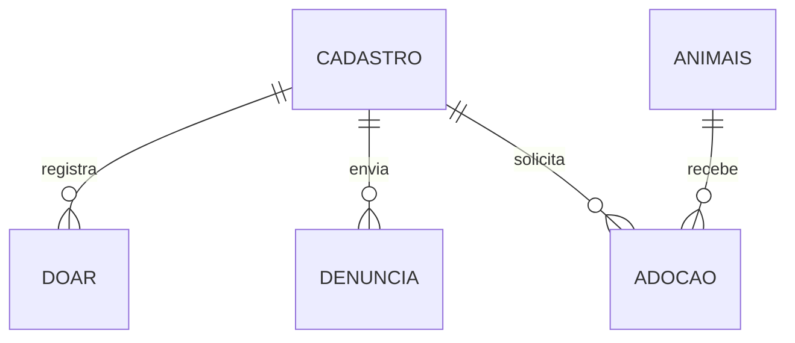

# Adota Pet

O Adota Pet é uma plataforma acadêmica de adoção responsável e proteção animal. O projeto reúne um catálogo persistido de animais, páginas individuais, organizações de referência, cadastro de doações, solicitações de adoção e denúncias, com área autenticada para usuários.

## Produção

- Aplicação: [https://adota-pet-jdzq.onrender.com](https://adota-pet-jdzq.onrender.com).
- Hospedagem: Render, web service Free com deploy automático da branch `main`.
- Banco: Neon PostgreSQL, plano Free.
- Custo da infraestrutura configurada: R$ 0.

A instância gratuita pode entrar em suspensão após 15 minutos sem tráfego. A primeira requisição após esse período pode levar cerca de um minuto.

## Tecnologias e arquitetura

- PHP 8.3 e Apache 2.4;
- PDO com PostgreSQL em produção e MySQL no ambiente local padrão;
- HTML5, CSS3 e JavaScript sem framework;
- Docker para build e execução reproduzíveis;
- Neon PostgreSQL com TLS obrigatório;
- Render para build do `Dockerfile`, health check e entrega HTTPS.

Fluxo em produção:

```text
Navegador --HTTPS--> Render/Apache/PHP --TLS--> Neon PostgreSQL
                         |
                         +--> migração idempotente na inicialização
```

As imagens, folhas de estilo e scripts são servidos pelo Apache. O PHP mantém a autenticação em sessão e acessa o banco exclusivamente por consultas preparadas.

## Execução local com Docker

Pré-requisito: Docker com o comando `docker compose`.

```bash
docker compose up --build
```

A aplicação fica disponível em `http://localhost:8080`. O Compose inicia o MySQL, espera o banco ficar saudável, cria as tabelas automaticamente e inicia o Apache.

Para executar a mesma aplicação com PostgreSQL local:

```bash
docker compose -f docker-compose.postgres.yml up --build
```

Para encerrar:

```bash
docker compose down
```

Para apagar também os dados locais:

```bash
docker compose down --volumes
```

## Variáveis de ambiente

Copie `.env.example` para `.env` somente no desenvolvimento. `.env` é ignorado pelo Git e nunca deve ser versionado.

| Variável | Finalidade | Padrão local |
| --- | --- | --- |
| `DATABASE_URL` | URL completa e secreta do PostgreSQL; tem prioridade sobre as demais variáveis | não definida |
| `DB_DRIVER` | `mysql` ou `pgsql` | `mysql` |
| `DB_HOST` | host do banco | `localhost` |
| `DB_PORT` | porta do banco | `3306` ou `5432` |
| `DB_NAME` | nome do banco | `adota_pet` |
| `DB_USER` | usuário do banco | `root` |
| `DB_PASS` | senha do banco | vazia |
| `RUN_MIGRATIONS` | executa o esquema idempotente ao iniciar o contêiner | `1` |
| `PORT` | porta TCP em que o Apache escuta | `8080` |

Em produção, configure `DATABASE_URL` somente como secret no provedor. URLs do Neon devem usar `sslmode=require`; a aplicação também aplica TLS obrigatório automaticamente a hosts `*.neon.tech`.

## Execução sem Docker

Use PHP 8.3 com a extensão PDO correspondente ao banco, defina as variáveis de ambiente e execute:

```bash
php scripts/migrate.php
php -S 127.0.0.1:8080
```

## Banco e migrações

Os esquemas iniciais ficam em `database/schema.mysql.sql` e `database/schema.pgsql.sql`. Evoluções ficam em `database/migrations/`, são registradas na tabela `schema_migrations` e podem ser executadas repetidamente com segurança. A migração atual preserva registros antigos ao adicionar relacionamentos opcionais nas tabelas já existentes; os novos fluxos sempre gravam esses relacionamentos.

Modelo principal:



- `animais` guarda os dados exibidos no catálogo e na página individual;
- `adocao.user_id` e `adocao.animal_id` associam cada solicitação ao usuário e animal corretos;
- `doar.user_id` e `denuncia.user_id` registram a autoria autenticada;
- o seed idempotente inclui oito animais e não duplica os registros em novas inicializações.

O entrypoint aguarda o banco ficar disponível antes de iniciar o Apache. Para executar a migração manualmente:

```bash
php scripts/migrate.php
```

## Deploy gratuito no Render

O `render.yaml` versionado define somente um web service Free, sem banco temporário do Render. O PostgreSQL persistente permanece no Neon.

1. Crie um Blueprint a partir do repositório `andertrunks/pii2-faculdade-pet-2`.
2. Confirme a branch `main` e o runtime Docker.
3. Informe `DATABASE_URL` no campo secreto solicitado pelo Blueprint.
4. Confirme que o plano exibido é `Free`, a região é `Virginia` e não há banco Render.
5. Aplique o Blueprint. O health check será `GET /health.php`.
6. Cadastre o deploy hook do Render no GitHub Actions como o segredo `RENDER_DEPLOY_HOOK`.

O workflow `.github/workflows/deploy-render.yml` executa qualidade estática e fluxos HTTP completos em MySQL e PostgreSQL em cada pull request. Em um push na `main`, o deploy hook secreto do Render só é acionado depois dos três jobs passarem. Isso mantém o autodeploy protegido por testes mesmo quando o serviço foi criado a partir da URL pública do repositório.

Não selecione `Starter`, `Standard`, `Pro`, workspace pago ou trial. A configuração aprovada usa apenas o web service Free.

## Verificações

Execute o smoke test:

```bash
php tests/smoke.php
```

O teste `tests/e2e.php` é executado pela CI contra bancos efêmeros. Ele cadastra e autentica um usuário temporário, envia adoção, doação e denúncia, verifica os relacionamentos no banco e remove somente os registros criados pelo próprio teste.

Valide a sintaxe de todos os arquivos PHP no PowerShell:

```powershell
Get-ChildItem -Recurse -Filter *.php | ForEach-Object { php -l $_.FullName }
```

O endpoint `GET /health.php` testa a aplicação e a conexão com o banco. Ele retorna HTTP 200 com `{"status":"ok"}` quando saudável e HTTP 503 sem detalhes sensíveis quando o banco não está disponível.

## Segurança

- credenciais somente por variáveis de ambiente e secrets do provedor;
- PostgreSQL remoto protegido por TLS e channel binding quando fornecido;
- senhas de usuários armazenadas com `password_hash`;
- consultas preparadas em todos os fluxos de gravação, leitura parametrizada e autenticação;
- validação de entrada e tokens CSRF nos formulários;
- cookies de sessão `HttpOnly`, `SameSite=Lax` e `Secure` em HTTPS;
- regeneração da sessão após login e limitação de tentativas;
- erros públicos sem detalhes de conexão ou SQL;
- PHP sem exposição de versão e com `display_errors=Off`;
- cabeçalhos HTTP de segurança, política CSP e listagem de diretórios desativada;
- login social decorativo removido: a aplicação anuncia somente o método de email e senha que realmente implementa.

## Estrutura

```text
components/       páginas, autenticação e rotinas PHP
css/              estilos da aplicação
database/         esquemas MySQL/PostgreSQL, migrações versionadas e seed
docker/           configuração do Apache, PHP e entrypoint
img/              imagens e recursos visuais
js/               interações da interface
scripts/          migrações e utilitários
tests/            smoke tests e fluxo HTTP ponta a ponta
Dockerfile        imagem PHP 8.3 + Apache
docker-compose.yml ambiente local com MySQL
docker-compose.postgres.yml ambiente local equivalente com PostgreSQL
render.yaml       web service Free e secret não sincronizado
```

## Contexto acadêmico

Este repositório registra um Projeto Integrador desenvolvido em grupo durante a faculdade. A interface, o conteúdo e o back-end resultam da colaboração entre integrantes da equipe.
